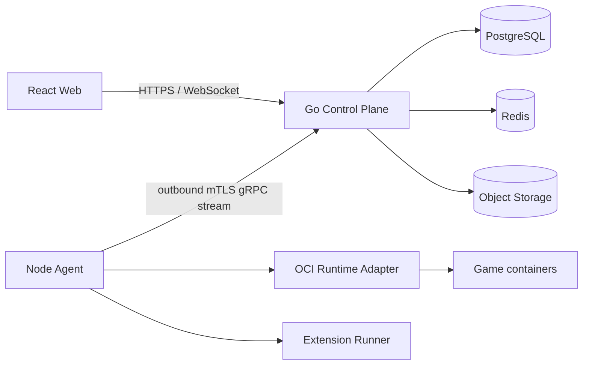

# 03 系统架构

## 1. 拓扑

Control Plane 是模块化单体；Worker 与 HTTP API 可以先部署为同一二进制中的不同运行单元，后续按负载独立扩展。Node Agent 是独立 Go 进程。

## 2. 组件边界

### Control Plane

负责身份、RBAC、节点目录、游戏目录、服务器期望状态、持久任务、审计和公共 API。它不访问节点 Docker Socket、游戏数据目录或宿主端口。

### Worker 与 Reconciler

PostgreSQL 中的任务表和事务 Outbox 是生产事实源。Worker 通过租约领取任务，将任务至少一次投递给 Agent；Reconciler 比较 generation、observedGeneration 与节点观测，创建必要的收敛任务。

Redis 只用于可重建的唤醒、短期缓存、限流和实时广播。Redis 丢失不能导致业务事实或任务永久丢失。

### Node Agent

Agent 主动建立出站 mTLS 双向流，负责节点能力、Runtime、端口、数据卷、日志、指标和扩展 Runner。Agent 使用本地 operation 日志抵御重复投递，并在重启后盘点受管容器。

### Runtime Adapter

统一封装 OCI、未来 VM 或其他 Runtime。游戏包不能直接调用 Runtime；只有 Agent 能调用适配器。首个生产适配器目标是 Docker Engine API，禁止把 Docker Socket 挂载给游戏容器。

### Extension Runner

只运行明确批准且固定摘要的扩展。扩展通过版本化 Host API 工作，默认无网络、无宿主文件访问、无进程派生。

## 3. 信任边界

| 边界 | 信任结论 |
| --- | --- |
| 浏览器到 Control Plane | 不可信输入；每次请求执行认证、授权、CSRF/Origin 与 Schema 校验 |
| Control Plane 到 Agent | 双向证书身份；任务仍需节点绑定、能力和幂等校验 |
| Agent 到 Runtime | Agent 接近宿主 root 信任级别，是重点加固与升级对象 |
| 游戏容器到宿主 | 不可信工作负载；非特权、最小挂载、资源限制、seccomp/AppArmor |
| GameDefinition/Extension | 未审核供应链输入；签名、来源、摘要、许可和权限检查 |

## 4. 一次异步操作的数据流

1. Web 发送会话、`Idempotency-Key` 和目标 generation。
2. API 在一个数据库事务中校验 RBAC、配额、节点与 Bundle，写业务状态、任务和 Outbox。
3. Worker 领取租约，选择绑定节点的 Agent 流并投递任务。
4. Agent 检查能力、资源、端口、本地 operation 日志和目标 generation。
5. Agent 调用 Runtime 或 Extension Runner，回报进度、检查点和结构化错误。
6. Control Plane 持久化任务结果和审计，再向 Web 广播更新。
7. Reconciler 处理超时、失联、重试与观测漂移。

同一服务器的破坏性任务串行执行；不同服务器可以并行。事件广播不是事实源，客户端重连后总能从 REST 快照恢复。

## 5. 开发适配器

本地垂直切片允许使用内存存储、模拟节点和模拟控制台，但必须满足领域接口与 API 契约。开发模式具备以下限制：

- 进程退出后状态重置。
- Network/Startup 只修改内存期望状态并创建模拟 `reconcile` operation；不执行真实容器、端口或资源限制。
- 当前 Allocation 只有单端口 bind IP/port/protocol/primary，Startup Secret 只在内存中保存并不回显。
- 不生成生产证书，不接受公网部署承诺。
- API 与界面显式返回 `environment: development`。

仓库内 PostgreSQL 迁移是生产骨架，当前没有承载 Allocation 的 primary/portRef 约束或 Startup 变量/Secret 持久模型；Redis、Outbox、任务租约、Agent mTLS/gRPC 和 OCI Runtime 同样未接入开发 Control Plane。

生产配置不得自动回退到开发适配器；缺少数据库、密钥或 Agent 信任根时必须启动失败。
