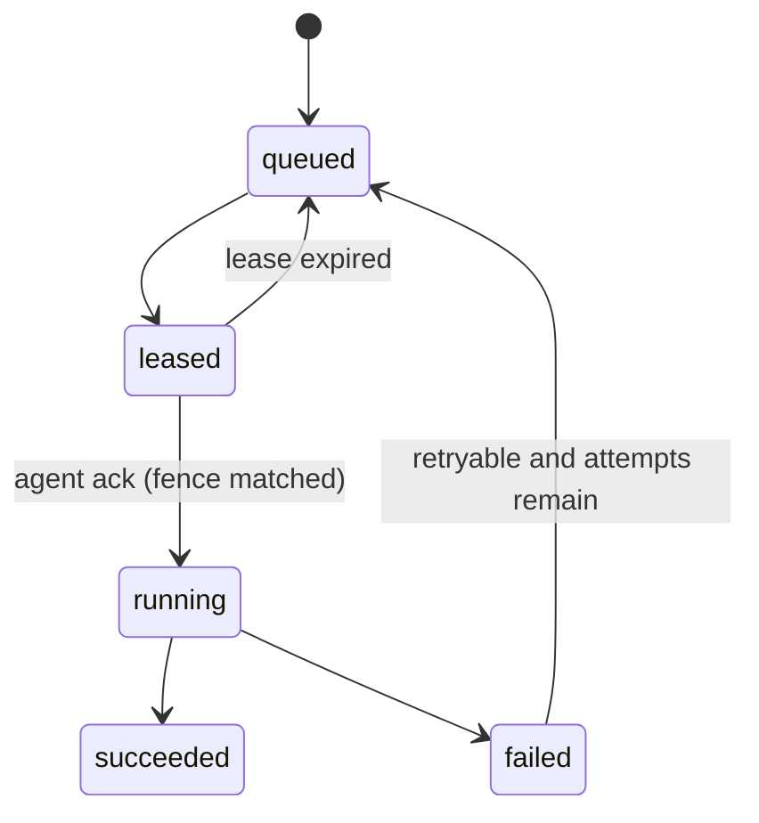

# 04 领域与任务模型

## 1. 状态维度

服务器状态不能用一个枚举同时表达容器、节点和任务。API 使用以下正交维度：

| 维度 | 值 | 说明 |
| --- | --- | --- |
| `lifecycleState` | `provisioning`, `ready`, `deleting`, `deleted` | 控制面资源生命周期 |
| `desiredPower` | `running`, `stopped` | 用户期望的稳定电源状态 |
| `observedPower` | `unknown`, `stopped`, `starting`, `running`, `stopping` | Agent 最近观测的 Runtime 电源状态 |
| `nodeCondition` | `available`, `offline`, `maintenance` | 节点是否可接收任务 |
| `healthCondition` | `unknown`, `healthy`, `unhealthy` | 游戏健康检查结果 |

`generation` 在期望配置、电源意图或互斥操作栅栏变化时递增。Agent 回报 `observedGeneration` 与 `observedAt`；generation 相等才表示当前观测对应最新期望，时间戳用于判断观测是否陈旧。`restart` 是一次操作，不改变最终 desiredPower，因此必须由任务表达。

删除采用软删除阶段和显式清理任务。只在 Agent 确认容器、端口和数据引用均处理后进入 `deleted`，随后按保留策略清理控制面记录。

## 2. 操作状态机

操作类型首批包括：`provision`、`start`、`stop`、`restart`、`kill`、`backup`、`restore`、`backup-delete`、`delete` 和 `reconcile`。数据库和 OpenAPI 对该值域做显式约束，新增类型必须同时更新迁移、协议、互斥规则和兼容性测试。

状态固定为 `queued → leased → running → succeeded/failed`；`dispatched` 与 `canceled` 已退出状态域（000009 把历史行压缩为 queued/failed）。`failed → queued` 只在重试模型允许且 attempt 未耗尽时发生，由 `ReconcileTaskLeases` 对账执行。

每次操作至少保存：`operationId`、`serverId`、`nodeId`、`type`、`status`、`generation`、`idempotencyKey`、`attempt`、`maxAttempts`、`leaseOwner`、`leaseExpiresAt`、`checkpoint`、结构化错误和时间戳。`nodeId` 是 operation 受理时固定的执行与投递节点快照；幂等回放、查询、重试和终态提交都不得从服务器当前节点动态回填或改写它。节点重分配必须使旧 operation 失败或取消，并为新 generation 在新节点创建新的 operation。

当前 development-memory Store 已为所有已实现的异步路径统一补齐公开执行元数据。新受理的 operation 使用 `attempt: 1`、`maxAttempts: 1` 和 `checkpoint: queued`，且不携带 lease 或错误；内存 worker 开始执行时进入 `running`，写入固定的 `development-memory-worker` lease、30 秒到期时间和按操作类型区分的 checkpoint；进入 `succeeded`、`failed` 或 `canceled` 终态时必须清除 lease。失败终态使用 `{ code, message, retryable }` 结构化错误，其中 `message` 只能包含可安全展示的信息。provision、电源、备份创建、恢复、备份删除和 reconcile 在提交结果前同时校验 operation 的 generation 与节点快照；目标服务器不存在、generation 已变化或服务器已重分配到另一节点时，都使用不可重试的 `OPERATION_STALE` 且不得提交资源副作用。服务器 stale 与备份摘要损坏或备份缺失同时发生时，必须优先返回 `OPERATION_STALE`；恢复和删除只把仍存在的临时 `restoring`/`deleting` recovery point 补偿回 `ready`。只有服务器栅栏通过后，恢复期间的备份摘要校验失败才使用 `BACKUP_INTEGRITY_FAILED`。

这些元数据只描述单进程开发 worker 的可观察生命周期。当前没有 lease 续期、到期抢占、重新入队、真实重试调度、PostgreSQL `server_tasks`、事务 Outbox、Agent 投递或跨副本恢复；`leaseOwner` 也不是授权凭据或分布式锁。生产实现必须以持久任务事实和原子状态转换替换这段内存模拟。

同一服务器的互斥操作串行执行。只读日志、指标订阅可以并行。恢复与删除会获得排他锁，禁止文件写入、电源和其他备份任务。当前开发 Store 已用每服务器门控把恢复登记与文件写入、建目录、移动、删除的检查及文件系统副作用串行化；恢复活动时这些写入返回 `409 OPERATION_IN_PROGRESS` 和现有 operation 信息。该进程内门控不等同于生产数据库租约或跨副本锁。

## 3. 幂等规则

- HTTP 客户端为可重试的写请求发送 `Idempotency-Key`，长度 16 至 128 个可打印 ASCII 字符。
- 作用域为 `actor + method + normalized route + target resource`，默认保留 24 小时。
- 同作用域、同键、同规范化请求体返回原 operation 和原响应状态。
- 同作用域、同键但请求体不同返回 `409 IDEMPOTENCY_KEY_REUSED`。
- 同一服务器已有等价未完成操作时，服务端可返回该 operation；互斥但不等价的活动任务返回 `409 OPERATION_IN_PROGRESS` 并携带现有 operation ID。文件已存在、目录非空或当前资源状态不允许动作等同步资源冲突使用 `409 OPERATION_CONFLICT`。
- Agent 以 operation ID 做永久或按任务保留期去重，重复投递返回最后检查点，不重复执行副作用。

## 4. 投递与租约

生产实现以 PostgreSQL 的 `server_tasks` 与事务 Outbox 为事实源。Worker 使用 `FOR UPDATE SKIP LOCKED` 领取有限租约，投递成功后更新状态；Redis 只负责唤醒，不参与唯一事实提交。

Agent 通信是至少一次投递，不承诺恰好一次。租约过期、连接中断或 Worker 崩溃后任务可重新入队。重试只适用于被错误模型标记为 `retryable` 的阶段；破坏性步骤必须保存可判定的检查点。

### 任务栅栏（000009）

- 状态机固定为 `queued → leased → running → succeeded/failed`；每次状态转换 `state_version` 单调 +1。
- 领取（claim）为任务签发一次性 `lease_token`（随机 UUID），并绑定领取该任务的 `connection_epoch`（每节点每次 Connect 会话严格递增）。
- `TaskAck`、`TaskProgress`、`RunningTaskHeartbeat`、`TaskResult` 必须回显 `node + epoch + attempt + lease_token` 四元组；任何一项不匹配或任务已终态时只能成为 stale no-op，绝不能覆盖终态或复活已重新入队的任务。
- 未携带 `lease_token` 的 legacy 消息（前一个稳定 Agent）只校验 `node + attempt`，保持兼容；新协议消息缺失租约凭据不享受栅栏保护。
- 租约 30 秒，Agent 执行期间每 10 秒以 `RunningTaskHeartbeat` 续租；过期后对账器清空租约与凭据并把未耗尽 attempt 的任务重新入队，attempt 耗尽的任务判 `MAX_ATTEMPTS` 终态失败。
- 任务输入与 checkpoint 分离：不可变输入存 `task_input`（jsonb），checkpoint 只承载执行期进度。新任务一律通过 typed proto arm（provision/power/backup）下发，不再创建 `payload_json` 任务；pre-000009 行仍以 legacy 载体兼容旧 Agent。

## 5. 核心实体与不变量

### Identity

- `users`：UUID、规范化唯一邮箱、显示名、密码 PHC 哈希、状态和时间戳。
- `roles`：稳定英文键；内置 `platform_admin` 和 `server_owner`。
- `user_roles`：用户与全局角色关联。
- `sessions`：只保存随机会话令牌的 SHA-256 摘要、用户、过期、撤销和最后访问时间。
- `setup_state`：生产目标保存首次初始化是否完成、Bootstrap Token 摘要和到期时间；成功创建首个管理员后原子关闭。
- `password_reset_tokens`：用户、SHA-256 摘要、到期、消费时间和签发者；明文只返回一次。

当前 1A Identity 开发适配器在单进程内存中实现同一状态模型。Bootstrap Token 和密码重置令牌只保存 SHA-256 摘要并按短 TTL、单次消费处理；密码重置或用户状态变为 `disabled` 时立即撤销该用户全部内存会话。进程退出会丢失用户、令牌、会话和 setup 状态，当前 Store 未连接 PostgreSQL 或 Redis。

### Nodes and allocations

- `nodes`：UUID、唯一名称、证书身份、版本、状态、最后心跳与容量。
- `node_capabilities`：节点、能力键和版本；未知能力显式拒绝。
- `allocations`：节点、绑定 IP、端口、协议、端口引用和主 Allocation 标记；生产实现对有效 endpoint 建立事务唯一约束，占用与释放在事务内完成。

当前开发适配器的 Allocation 只有服务器、节点、绑定 IP、端口、协议和 `primary`。它在单进程内保持每台服务器恰好一个主 Allocation，拒绝精确 endpoint 重复和 unspecified 地址，但没有 `portRef`、容器端口、端口角色、数据库约束或操作系统端口预留。因此它只能表达单端口期望状态，不能证明多端口映射或 Runtime 绑定安全。

### Catalog and servers

- `game_definitions`：稳定游戏 ID、来源和审核状态。
- `game_bundles`：定义版本、上游游戏版本、不可变摘要、签名、许可、兼容范围和发布时间。
- `servers`：所有者、节点、创建时的发布快照、资源配额、五类状态、generation 与 observedGeneration。
- `server_members`：服务器、用户与权限集合；服务器与用户组合唯一。
- `server_startup_values`：生产目标保存服务器固定 Bundle 所声明变量的覆写；Secret 与普通值分离存储并按密钥版本加密，调用方不能改变 Schema 中的 Secret 身份。

当前 membership 同样存于内存。授予或替换时必须包含基础 `servers.read`，撤销后服务器列表、详情和受保护 REST API 在下一次请求立即重新授权；尚无持久事务、跨副本缓存失效或实时连接关闭协议。

### Operations, backups and audit

- `server_tasks`：操作事实、幂等键、租约、重试、检查点与错误。
- `outbox_events`：与业务事务原子写入，发布后可清理或归档。
- `backups`：服务器、状态、内容摘要、大小、位置、创建者和保留期限。
- `audit_events`：只追加；包含操作者、动作、目标、结果、operation ID、客户端上下文和安全裁剪后的元数据。

当前开发适配器会为备份创建、恢复、删除和 reconcile 记录终态审计。若目标 Server 在 operation 收敛前已不存在，审计目标名称使用稳定的 `serverId`，仍必须记录 `failure`，不能因为展示名称不可用而丢失终态事实。

创建服务器、分配端口和写 provision 任务必须在同一事务中成功或回滚。恢复锁与备份状态也必须由数据库约束，而不是只在进程内互斥。当前 `migrations/000001_core` 提供早期生产骨架，`migrations/000002_identity` 增加密码重置令牌表和 server membership 更新时间；迁移仍未包含 setup 状态、Allocation 的 primary/portRef 约束或 Startup 变量/Secret 表，开发 Control Plane 也未接入已有用户、会话、密码重置令牌和 membership 表。内存适配器的不变量不能外推为 PostgreSQL 事务保证。

服务器的发布快照是原子四元组 `(gameDefinitionId, gameDefinitionVersion, gameVersion, gameBundleDigest)`。摘要是执行与完整性校验的权威身份，两个版本字段用于展示、兼容判断和审计；目录记录后续变化不得反向污染已有服务器。升级时源四元组与目标四元组必须原子提交或回滚。

当前 Startup 开发适配器从该固定摘要对应的内嵌 Bundle 派生命令、变量类型、默认值与 Secret 身份，只接受 Schema 已声明的键。变量覆写和 Secret 明文仍位于进程内存；读取 Secret 时只返回 `hasValue`，幂等请求摘要使用每进程随机密钥的 HMAC-SHA256。HMAC 防止把低熵 Secret 直接暴露为普通哈希，但不提供静态加密、持久化、密钥轮换或 Agent 传输能力。

Network 与 Startup 的首次写入都检查调用方提交的 generation、递增服务器 generation，并创建互斥的 `reconcile` operation。只有 operation generation 仍等于服务器当前 generation 时，模拟收敛才推进 `observedGeneration`。当前状态和幂等记录随进程退出而丢失。

## 6. 标识和时间

- 公共资源 ID 使用小写 RFC 4122 UUID 字符串。
- 时间在 API 中使用 UTC RFC 3339，数据库使用带时区时间；界面按用户时区显示。
- `traceId` 用于一次调用链，`operationId` 用于跨重试的业务操作，两者不能互换。
- 列表排序必须有唯一 ID 作为最终稳定排序键。
